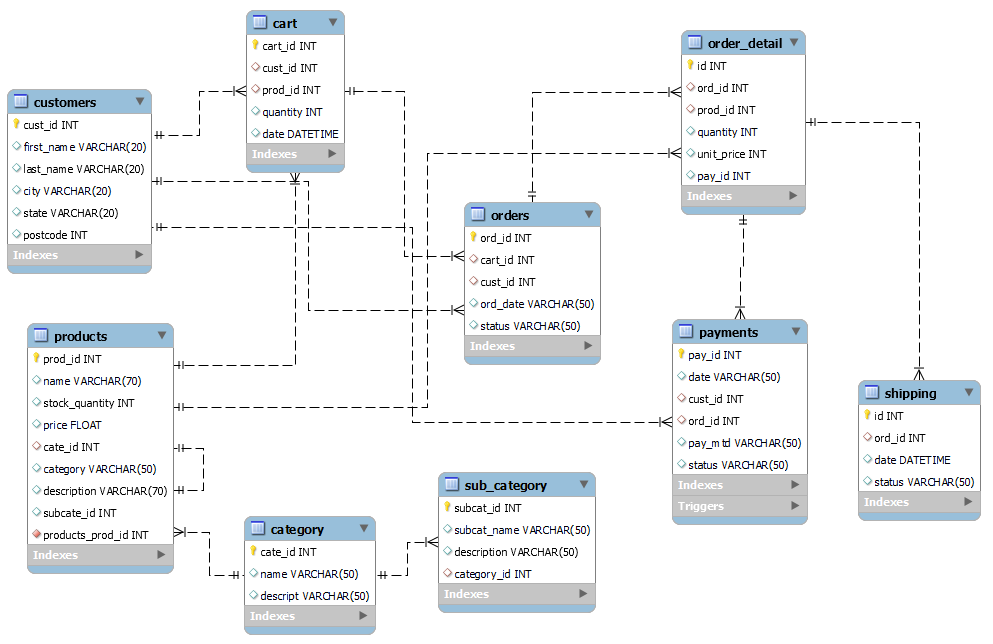

# Scalable eCommerce Database Architecture (MS SQL)

## Overview  
This project involves the design and implementation of a robust and scalable Microsoft SQL Server database architecture to support complex eCommerce workflows. The database schema is engineered to ensure data integrity, optimise query performance, and provide seamless transactional support for high-volume operations.

## Features  
- Relational database schema design tailored for eCommerce operations  
- Creation of tables to store transactional and master data  
- Implementation of stored procedures to encapsulate business logic  
- Development of views for simplified data access and reporting  
- Indexing strategies to enhance query performance  
- Data integrity enforcement through constraints and relational keys

## Technologies  
- Microsoft SQL Server (MS SQL)  
- SQL (DDL, DML, DCL)  
- Stored Procedures, Views, Indexes

## Approach  
- Analysed eCommerce business workflows to design an efficient relational schema  
- Developed tables for key entities such as orders, customers, products, and transactions  
- Created stored procedures for common operations like calculating totals and processing orders  
- Designed views to facilitate reporting and analytics  
- Applied indexing and optimisation techniques to reduce query response time  
- Ensured data consistency with primary keys, foreign keys, and constraints

## Getting Started  
1. Clone the repository (if applicable)  
2. Run the provided SQL scripts to create the database schema, tables, views, and stored procedures  
3. Populate the tables with sample or production data  
4. Use the stored procedures and views to manage and query data efficiently

## Benefits  
- Reliable and scalable backend to support eCommerce transactions  
- Faster query performance and reduced latency  
- Easier maintenance and extension due to modular stored procedures and views  
- Strong data integrity and consistency guarantees

